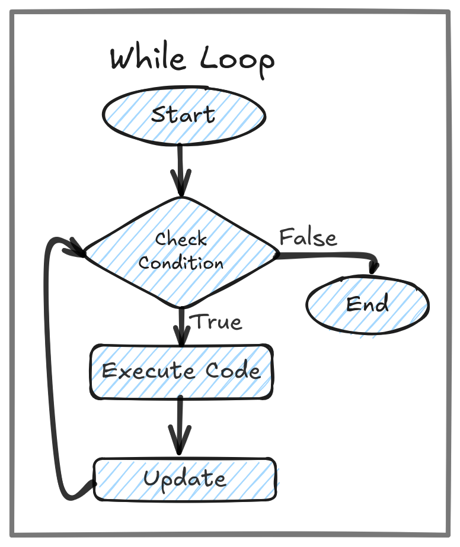

## Difference Between For, While & Do-While Loop

Loops are primarily used for preforming repeatating tasks.

### For Loop
For loop performs best when the end point of the tasks are well defined. `For` loop contains three property, `Initialization`, `Condition`, `Update`.
```js
    for(Initialization; Conditin; Update){
        // Coding Statements
    }
```
#### Example
```js
    // Printing 1 - 5
    for(let i = 1; i < 5; i++){
        console.log(i);
    }
```
#### Flow Chart


******
### While Loop
While loop performs best when the end point of the tasks are not well defined, relay on an condition. When the condition met, Coding statwments of  `while` loop executes. `while` loop  contains Two property,  `Condition`& `Update`.
```js
    while(Conditin){
        // Coding Statements
        Update;
    }
```
#### Example
```js
    // Printing 1 - 5
    let i = 1;
    while(i < 5){
        console.log(i);
         i++;
    }
```
#### Flow Chart


******
### Do-While Loop
`do`-`while` loop oftenly used to perform the task atleast one time. 
 
```js
    do{
        // Coding Statements
        Update;
    }while(Conditin);
```
#### Example
```js
    // Printing 1 - 5
    let i = 1;
    do{
        console.log(i);
         i++;
    }while(i < 5);
```
#### Flow Chart
